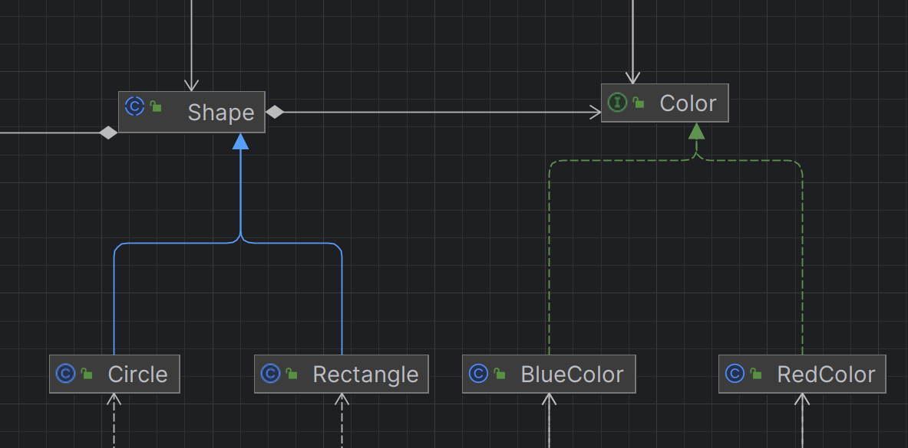

# Оглавление

***

- [Задание 2. Singleton](#задание-2-singleton)
- [Задание 3. Prototype](#задание-3-prototype)
- [Задание 4. Static Factory Method](#задание-4-static-factory-method)
- [Задание 5. Builder](#задание-5-builder)
- [Задание 6. Factory Method](#задание-6-factory-method)
- [Задание 7. Abstract Factory](#задание-7-abstract-factory)
- [Задание 8. Adapter](#задание-8-adapter)
- [Задание 9. Bridge](#задание-9-bridge)
- [Задание 10. Composite](#задание-10-composite)
- [Задание 11. Decorator](#задание-11-decorator)
- [Задание 12. Facade](#задание-12-facade)
- [Задание 13. Flyweight](#задание-13-flyweight)
- [Задание 14. Proxy](#задание-14-proxy)
- [Задание 15. Chain of Responsibility](#задание-15-chain-of-responsibility)
- [Задание 16. Command](#задание-16-command)
- [Задание 17. Interpreter](#задание-17-interpreter)
- [Задание 18. Iterator](#задание-18-iterator)
- [Задание 19. Mediator](#задание-19-mediator)
- [Задание 20. Memento](#задание-20-memento)

***

## Задание 2. Singleton

### Описание

В этом разделе описан класс [`NoteService`](./src/main/java/ru/patterns/services/NoteService.java), который реализует паттерн проектирования Singleton. Singleton — это паттерн, который ограничивает создание объекта класса одним экземпляром и предоставляет глобальную точку доступа к этому экземпляру.

### Причины выбора Singleton для класса `NoteService`

1. **Глобальная точка доступа**: Паттерн Singleton обеспечивает наличие единственного экземпляра `NoteService` в приложении. Это позволяет централизованно управлять всеми операциями, связанными с заметками, через один объект, что упрощает управление состоянием и логикой.

2. **Контроль над созданием экземпляра**: Поскольку `NoteService` содержит логику для работы с данными, важно, чтобы существовал только один экземпляр этого класса, который управлял бы доступом к репозиторию заметок. Использование Singleton предотвращает создание нескольких экземпляров, что может привести к неконсистентности данных или избыточному потреблению ресурсов.

3. **Ленивое создание**: Экземпляр `NoteService` создается лениво при первом обращении через метод `getInstance()`. Это обеспечивает экономию ресурсов, так как объект создается только тогда, когда он действительно нужен.

### Признаки реализации Singleton в классе `NoteService`

- **Приватный конструктор**: Конструктор класса `NoteService` объявлен как `private`, что предотвращает создание экземпляров класса извне. Это обязательное требование для паттерна Singleton, чтобы контролировать создание объектов.

- **Статическое поле для хранения экземпляра**: В классе определено статическое поле `instance`, которое хранит единственный экземпляр `NoteService`. Это поле используется для проверки, существует ли уже экземпляр класса, и для его создания при необходимости.

- **Статический метод для доступа к экземпляру**: Метод `getInstance()` предоставляет глобальную точку доступа к единственному экземпляру класса. Он проверяет, был ли уже создан экземпляр, и создает его при первом вызове.

Пример кода класса `NoteService`:

```java
/**
 * Паттерн Singleton.
 */
@Service
public class NoteService {

    private final NoteRepository noteRepository;
    private static NoteService instance;

    private NoteService(NoteRepository noteRepository) {
        this.noteRepository = noteRepository;
    }

    public static NoteService getInstance(NoteRepository noteRepository) {
        if (instance == null) {
            instance = new NoteService(noteRepository);
        }
        return instance;
    }

    /**
     * Получает список всех заметок.
     *
     * @return Список всех заметок.
     */
    public List<Note> getAllNotes() {
        return noteRepository.findAll();
    }

    /**
     * Добавляет новую заметку в базу данных.
     *
     * @param noteDto DTO заметки, которую нужно добавить.
     * @return Сохраненная заметка.
     */
    public Note addNote(NoteDTO noteDto) {
        Note note = new Note();
        note.setTitle(noteDto.getTitle());
        note.setContent(noteDto.getContent());
        return noteRepository.save(note);
    }

    /**
     * Получает заметку по ее уникальному идентификатору.
     *
     * @param id Уникальный идентификатор заметки.
     * @return Optional, содержащий заметку, если она найдена, иначе пустой
     *         Optional.
     */
    public Optional<Note> getNoteById(Long id) {
        return noteRepository.findById(id);
    }

    /**
     * Удаляет заметку из базы данных по ее уникальному идентификатору.
     *
     * @param id Уникальный идентификатор заметки, которую нужно удалить.
     */
    public void deleteNoteById(Long id) {
        noteRepository.deleteById(id);
    }
}
```

***

## Задание 3. Prototype

### Описание

В этом разделе описан класс [`Note`](./src/main/java/ru/patterns/models/Note.java), который реализует паттерн проектирования Prototype. Prototype — это паттерн, который позволяет создавать новые объекты путем копирования уже существующих. Вместо создания нового экземпляра через конструктор, мы используем метод копирования, чтобы создать дубликат объекта.

### Причины выбора Prototype для класса `Note`

1. **Гибкость создания объектов**: Паттерн Prototype упрощает процесс создания дубликатов объектов. В случае класса `Note`, это важно, когда требуется скопировать существующую заметку и создать ее клон с аналогичными свойствами.

2. **Изоляция логики копирования**: Логика копирования инкапсулирована внутри объекта `Note`, что позволяет избежать дублирования кода и повышает гибкость программы. Всякий раз, когда требуется создать копию заметки, паттерн гарантирует, что все необходимые поля будут скопированы корректно.

3. **Упрощение дублирования объектов**: Использование метода `copy()` позволяет избежать сложностей, связанных с созданием новых объектов через конструктор, особенно если объект имеет сложную структуру или большое количество полей.

### Признаки реализации Prototype в классе `Note`

- **Реализация интерфейса Prototype**: Класс `Note` реализует интерфейс `Prototype`, который содержит метод `copy()`. Это позволяет классу явно определить, каким образом будет создана копия объекта.

- **Метод `copy()` для создания дубликатов**: Метод `copy()` создает новый объект `Note`, копируя значения полей `title` и `content` оригинальной заметки. Это ключевая часть паттерна Prototype, которая позволяет создавать дубликаты объектов.

### Пример кода класса `Note`:

```java
/**
 * Паттерн Prototype.
 */
@Entity
@Table(name = "notes")
public class Note implements Prototype {

    @Id
    @GeneratedValue(strategy = GenerationType.IDENTITY)
    private Long id;

    @NotBlank(message = "Title cannot be blank")
    private String title;
    private String content;
    private LocalDateTime timestamp;

    @PrePersist
    protected void onCreate() {
        timestamp = LocalDateTime.now();
    }

    public Note() {
    }

    public Note(String title, String content) {
        this.title = title;
        this.content = content;
        this.timestamp = LocalDateTime.now();
    }

    public Long getId() {
        return id;
    }

    public void setId(Long id) {
        this.id = id;
    }

    public String getTitle() {
        return title;
    }

    public void setTitle(String title) {
        this.title = title;
    }

    public String getContent() {
        return content;
    }

    public void setContent(String content) {
        this.content = content;
    }

    public LocalDateTime getTimestamp() {
        return timestamp;
    }

    public void setTimestamp(LocalDateTime timestamp) {
        this.timestamp = timestamp;
    }

    /**
     * Создает копию объекта Note.
     * 
     * @return Новый объект Note с теми же значениями полей.
     */
    @Override
    public Prototype copy() {
        return new Note(this.title, this.content);
    }
}
```
***

## Задание 4. Static Factory Method

### Описание

В этом разделе описан класс [`NoteUtils`](./src/main/java/ru/patterns/utils/NoteUtils.java), который реализует паттерн проектирования Static Factory Method. Этот паттерн предоставляет статические методы для создания и изменения объектов, что улучшает читаемость и управление кодом.

### Причины выбора Static Factory Method для класса `NoteUtils`

1. **Упрощение создания объектов**: Паттерн Static Factory Method позволяет создавать и изменять объекты через статические методы, что упрощает код и делает его более понятным. Вместо создания объектов через конструктор, мы можем использовать методы с ясными названиями.

2. **Удобство использования**: Статические методы могут быть вызваны без необходимости создания экземпляра класса, что делает их удобными для использования в различных частях приложения.

### Признаки реализации Static Factory Method в классе `NoteUtils`

- **Статические методы для изменения свойств**: В классе определены статические методы `changeTitle`, `changeContent` и `updateNote`, которые изменяют соответствующие свойства объекта `Note`.

- **Приватный конструктор**: Конструктор класса `NoteUtils` объявлен как `private`, что предотвращает создание экземпляров этого класса. Это является стандартной практикой для утилитарных классов, содержащих только статические методы.

### Пример кода класса `NoteUtils`:

```java
/**
 * Паттерн Static Factory Method.
 */
public class NoteUtils {

    private NoteUtils() {
    }

    public static void changeTitle(Note note, String newTitle) {
        note.setTitle(newTitle);
    }

    public static void changeContent(Note note, String newContent) {
        note.setContent(newContent);
    }

    public static void updateNote(Note note, String newTitle, String newContent) {
        note.setTitle(newTitle);
        note.setContent(newContent);
        note.setTimestamp(LocalDateTime.now());
    }
}
```


## Задание 5. Builder

### Описание

В этом разделе описан класс [`SwaggerConfig`](./src/main/java/ru/patterns/config/SwaggerConfig.java), который реализует паттерн проектирования Builder. Паттерн Builder предоставляет способ пошагового создания сложных объектов, позволяя избежать необходимости передавать множество параметров в конструктор.

### Причины выбора Builder для класса `SwaggerConfig`

1. **Упрощение конфигурации**: Использование паттерна Builder в `SwaggerConfig` упрощает процесс настройки групп API для Swagger. Вместо создания экземпляров с помощью длинного списка параметров, вы можете пошагово настраивать объект, что делает код более понятным и поддерживаемым.

2. **Повышение читабельности кода**: Паттерн Builder позволяет явно указывать, какие параметры вы настраиваете для объекта. Это упрощает понимание конфигурации и ее последующее редактирование, особенно если в будущем потребуется добавить новые параметры.


### Признаки реализации Builder в классе `SwaggerConfig`

- **Использование методов для настройки параметров**: В классе `SwaggerConfig` используются методы `group()`, `packagesToScan()`, и `pathsToMatch()` для пошаговой настройки экземпляра `GroupedOpenApi`. Это позволяет четко структурировать код и легко добавлять новые параметры при необходимости.

- **Финальный метод `build()`**: Метод `build()` используется для создания окончательного экземпляра объекта `GroupedOpenApi`. Это явный сигнал о том, что все необходимые параметры были установлены, и объект готов к использованию.

### Пример кода класса `SwaggerConfig`:

```java
/**
 * Паттерн Builder.
 */
@Configuration
public class SwaggerConfig {

    @Bean
    public GroupedOpenApi notesApi() {
        return GroupedOpenApi.builder()
                .group("notes-api")
                .packagesToScan("ru.patterns.controllers")
                .pathsToMatch("/notes/**")
                .build();
    }

    @Bean
    public GroupedOpenApi homeApi() {
        return GroupedOpenApi.builder()
                .group("home-api")
                .packagesToScan("ru.patterns.controllers")
                .pathsToMatch("/")
                .build();
    }
}
```


## Задание 6. Factory Method

### Описание

В этом разделе описаны классы и интерфейсы, которые реализуют паттерн проектирования **Factory Method** для создания объектов различных форм в приложении с использованием класса [`Canvas`](./src/main/java/ru/patterns/models/Canvas.java). Паттерн Factory Method предоставляет интерфейс для создания объектов в суперклассе, позволяя подклассам изменять тип создаваемого объекта.

### Причины выбора Factory Method для создания фигур

1. **Отделение создания объектов от их использования**: Паттерн Factory Method позволяет отделить логику создания фигур от их использования. Это упрощает управление созданием объектов и улучшает гибкость кода, поскольку детали создания могут быть изменены, не влияя на остальную часть приложения.

2. **Поддержка расширяемости**: Легко добавлять новые типы фигур, просто создавая новые реализации интерфейса [`ShapeFactory`](./src/main/java/ru/patterns/factory/ShapeFactory.java), не меняя существующий код. Это позволяет расширять функциональность приложения, не нарушая уже работающий функционал.


### Признаки реализации Factory Method в классе

- **Интерфейс [`ShapeFactory`](./src/main/java/ru/patterns/factory/ShapeFactory.java)**  **: Этот интерфейс определяет метод `createShape()`, который должен быть реализован всеми конкретными фабриками. Это позволяет создавать различные формы, не указывая конкретные классы, которые будут созданы.

- **Конкретные фабрики**: Классы [`CircleFactory`](./src/main/java/ru/patterns/factory/CircleFactory.java) и [`RectangleFactory`](./src/main/java/ru/patterns/factory/RectangleFactory.java) реализуют интерфейс [`ShapeFactory`](./src/main/java/ru/patterns/factory/ShapeFactory.java) и предоставляют конкретные реализации метода `createShape()`, создавая соответствующие объекты [`Circle`](./src/main/java/ru/patterns/models/Circle.java] и [`Rectangle`](./src/main/java/ru/patterns/models/Rectangle.java). Эти фабрики принимают параметры, необходимые для создания объектов.

### Пример кода классов Factory Method

#### Интерфейс ShapeFactory

```java
public interface ShapeFactory {
    Shape createShape();
}
```

#### Конкретные фабрики

```java
public class RectangleFactory implements ShapeFactory {

    private double width;
    private double height;

    public RectangleFactory(double width, double height) {
        this.width = width;
        this.height = height;
    }

    @Override
    public Shape createShape() {
        return new Rectangle(width, height);
    }
}

public class CircleFactory implements ShapeFactory {

    private double radius;

    public CircleFactory(double radius) {
        this.radius = radius;
    }

    @Override
    public Shape createShape() {
        return new Circle(radius);
    }
}
```


# Задание 7. Abstract Factory

## Описание

В этом разделе описаны классы и интерфейсы, которые реализуют паттерн проектирования **Abstract Factory** для создания объектов блокнотов и блокнотов различных типов в приложении. Abstract Factory предоставляет интерфейс для создания семейства связанных или зависимых объектов без указания их конкретных классов.

## Причины выбора Abstract Factory

1. **Создание семейства объектов**: Паттерн Abstract Factory идеально подходит, когда нужно создать группу объектов, которые связаны между собой. В нашем случае это тетради и блокноты, каждый из которых может иметь различные реализации (школьные, офисные и дизайнерские).

2. **Изоляция клиентского кода от конкретных реализаций**: Abstract Factory изолирует процесс создания объектов от их использования, что повышает гибкость и упрощает поддерживаемость кода. Пользователи фабрики взаимодействуют с общими интерфейсами, не зная деталей создания объектов.

3. **Легкость расширения**: Добавление новых типов блокнотов или блокнотов возможно без изменения существующего кода. Нужно лишь создать новую реализацию фабрики и объектов, что делает систему гибкой и расширяемой.

## Признаки реализации Abstract Factory

- **Интерфейс `StationeryFactory`**: Этот интерфейс определяет методы для создания объектов `NoteBook` и `NotePad`, предоставляя абстракцию для всех конкретных фабрик.

- **Конкретные фабрики**: Классы `OfficeStationeryFactory` и `SchoolStationeryFactory` реализуют интерфейс `StationeryFactory` и предоставляют конкретные реализации методов для создания офисных и школьных блокнотов и блокнотов соответственно.

- **Интерфейсы для продуктов**: Интерфейсы `NoteBook` и `NotePad` описывают общие методы для всех блокнотов и блокнотов, позволяя реализовать различные типы этих объектов.

- **Конкретные продукты**: Классы `OfficeNotebook`, `SchoolNotebook`, `SimpleNotepad` и `DesignerNotepad` представляют конкретные реализации продуктов.

## Код классов Abstract Factory

### Интерфейс StationeryFactory

```java
public interface StationeryFactory {
    NoteBook createNoteBook();
    NotePad createNotePad();
}
```


### Конкретные фабрики

```java
public class OfficeStationeryFactory implements StationeryFactory {

    @Override
    public NoteBook createNoteBook() {
        return new OfficeNotebook();
    }

    @Override
    public NotePad createNotePad() {
        return new SimpleNotepad();
    }
}

public class SchoolStationeryFactory implements StationeryFactory {

    @Override
    public NoteBook createNoteBook() {
        return new SchoolNotebook();
    }

    @Override
    public NotePad createNotePad() {
        return new DesignerNotepad();
    }
}
```

### Интерфейсы для продуктов

```java
public interface NoteBook {
    void describe();
}

public interface NotePad {
    void describe();
}
```

### Конкретные продукты

```java
public class OfficeNotebook implements NoteBook {

    @Override
    public void describe() {
        System.out.println("This is an office notebook.");
    }
}

public class SchoolNotebook implements NoteBook {

    @Override
    public void describe() {
        System.out.println("This is a school notebook.");
    }
}

public class SimpleNotepad implements NotePad {

    @Override
    public void describe() {
        System.out.println("This is a simple notepad.");
    }
}

public class DesignerNotepad implements NotePad {

    @Override
    public void describe() {
        System.out.println("This is a designer notepad.");
    }
}
```


## Задание 8. Adapter

### Описание

В этом разделе описан класс `TemperatureServiceAdapter`, который реализует паттерн проектирования Adapter. Adapter позволяет несовместимым интерфейсам работать вместе, преобразуя интерфейс одного класса в ожидаемый клиентом интерфейс.

### Причины выбора Adapter для `TemperatureServiceAdapter`

1. **Совместимость интерфейсов**: Adapter обеспечивает совместимость между интерфейсом `TemperatureService` и классом `WeatherApiClient`, позволяя использовать его без изменений.

2. **Скрытие сложности**: Адаптер скрывает сложность работы с внешним API, предоставляя простой интерфейс для получения температуры в городе.

3. **Повторное использование кода**: Адаптер позволяет повторно использовать `WeatherApiClient`, снижая дублирование кода и упрощая разработку.

### Признаки реализации Adapter в `TemperatureServiceAdapter`

- **Имплементация целевого интерфейса**: `TemperatureServiceAdapter` реализует интерфейс `TemperatureService` с методом `getTemperature`.

- **Взаимодействие с адаптируемым объектом**: Метод `getTemperature` вызывает `getCurrentWeatherData` из `WeatherApiClient` и извлекает температуру.

### Реализация паттерна Adapter

```java
// Интерфейс целевого объекта
public interface TemperatureService {
    Double getTemperature(String city);
}

// Интерфейс адаптируемого объекта
public interface WeatherApi {
    Map<String, Object> getCurrentWeatherData(String city);
}

// Конкретная реализация адаптируемого объекта
@Component
public class WeatherApiClient implements WeatherApi {

    private final RestTemplate restTemplate;
    private final String apiKey = "6996b38d22fd438a876113325240910";

    public WeatherApiClient(RestTemplate restTemplate) {
        this.restTemplate = restTemplate;
    }

    @Override
    public Map getCurrentWeatherData(String city) {
        String url = "http://api.weatherapi.com/v1/current.json?key=" + apiKey + "&q=" + city;

        HttpHeaders headers = new HttpHeaders();
        HttpEntity<String> entity = new HttpEntity<>(headers);

        ResponseEntity<Map> response = restTemplate.exchange(url, HttpMethod.GET, entity, Map.class);

        return response.getBody();
    }
}

// Адаптер
@Service
public class TemperatureServiceAdapter implements TemperatureService {

    private final WeatherApiClient weatherApiClient;

    public TemperatureServiceAdapter(WeatherApiClient weatherApiClient) {
        this.weatherApiClient = weatherApiClient;
    }

    @Override
    public Double getTemperature(String city) {
        var current = (Map) weatherApiClient.getCurrentWeatherData(city).get("current");
        return (Double) current.get("temp_c");
    }
}


```

# Задание 9. Bridge



## Описание

В этом разделе описан класс, который реализует паттерн проектирования Bridge. Паттерн Bridge разделяет абстракцию и реализацию, позволяя изменять их независимо.

## Преимущества использования паттерна Bridge:

- Упрощение системы, избегая создания большого количества подклассов.
- Возможность изменять реализацию и абстракцию независимо, что упрощает расширение системы.
- Улучшение читаемости и поддерживаемости кода.

## Пример реализации паттерна Bridge:

В данном проекте используется паттерн Bridge, где абстракция представлена классом [`Shape`](./src/main/java/ru/patterns/models/Shape.java), а реализация — классами [`Color`](./src/main/java/ru/patterns/interfaces/Color.java) (например, [`RedColor`](./src/main/java/ru/patterns/models/RedColor.java) и [`BlueColor`](./src/main/java/ru/patterns/models/BlueColor.java)).

- **Абстракция**: `Shape` (класс, представляющий геометрическую фигуру, с методом `draw()`, который будет использовать цвет).
- **Реализация**: `Color` (интерфейс, определяющий методы для применения цвета).
- **Конкретные реализации**: `RedColor` и `BlueColor` (классы, реализующие интерфейс `Color`).

Такое разделение позволяет добавлять новые фигуры или цвета, не изменяя существующие классы.


***


## Задание 10. Composite

### Описание

В этом разделе описан класс `CanvasComponent`, который реализует паттерн проектирования **Composite**. Composite — это паттерн, позволяющий создавать древовидные структуры объектов, где каждая ветвь или лист структуры может обрабатываться единообразно. Он объединяет объекты в древовидные структуры для представления иерархий «часть-целое».

### Причины выбора Composite для структуры «Canvas» и «Folders»

1. **Удобная иерархическая структура**:
   Composite позволяет организовать структуру объектов в виде дерева, что подходит для хранения элементов, таких как папки и холсты, в системе, где они могут быть сгруппированы в другие папки или быть листовыми элементами (например, `Canvas`). Каждый элемент в такой структуре рассматривается одинаково — будь то отдельный элемент или целая группа элементов.

2. **Единая обработка компонентов**:
   Composite обеспечивает единый интерфейс для управления как простыми объектами (например, холстами), так и составными объектами (например, папками). Это делает код более гибким и упрощает работу с элементами, позволяя использовать одну и ту же логику как для отдельных объектов, так и для их коллекций.

3. **Гибкость в добавлении и удалении элементов**:
   Composite предоставляет методы для добавления, удаления и получения компонентов в составе других компонентов. Это полезно в тех случаях, когда объекты могут быть объединены в более сложные структуры иерархии, например, когда холсты могут находиться в папках, а папки могут содержать как холсты, так и другие папки.

### Признаки реализации Composite в классе `CanvasComponent`

- **Абстрактный базовый класс или интерфейс**:
  `CanvasComponent` является базовым классом, который определяет общие операции для всех компонентов иерархии, такие как методы `add()`, `remove()` и `getChildren()`. Этот класс представляет общие операции для всех объектов (папок и холстов) в структуре.

- **Компоненты-листья и составные компоненты**:
  В структуре реализованы как компоненты-листья (`Canvas`), так и составные компоненты (`CanvasFolder`), которые могут содержать другие компоненты. Это ключевая часть Composite, где листья (примитивные элементы) и составные элементы обрабатываются единообразно.

- **Методы для управления дочерними элементами**:
  В составных компонентах (например, в `CanvasFolder`) реализованы методы для добавления, удаления и получения дочерних компонентов, что делает возможным создание древовидных структур.

### Реализация паттерна Composite

```java
@Entity
@Inheritance(strategy = InheritanceType.JOINED)
public abstract class CanvasComponent {

    @Id
    @GeneratedValue(strategy = GenerationType.IDENTITY)
    private Long id;

    private String name;

    public Long getId() {
        return id;
    }

    public String getName() {
        return name;
    }

    public void setName(String name) {
        this.name = name;
    }

    public abstract void add(CanvasComponent component);

    public abstract void remove(CanvasComponent component);

    public abstract List<CanvasComponent> getChildren();
}

@Entity
@Table(name = "canvas")
public class Canvas extends CanvasComponent {

    @Id
    @GeneratedValue(strategy = GenerationType.IDENTITY)
    private Long id;

    private String name;

    @OneToMany(mappedBy = "canvas", cascade = CascadeType.ALL)
    private List<Shape> shapes = new ArrayList<>();

    public Canvas() {
    }

    public Canvas(String name) {
        this.name = name;
    }

    public Long getId() {
        return id;
    }

    public void setId(Long id) {
        this.id = id;
    }

    public String getName() {
        return name;
    }

    @Override
    public void add(CanvasComponent component) {
        throw new UnsupportedOperationException("Canvas cannot contain other components.");
    }

    @Override
    public void remove(CanvasComponent component) {
        throw new UnsupportedOperationException("Canvas cannot contain other components.");
    }

    @Override
    public List<CanvasComponent> getChildren() {
        return Collections.emptyList();
    }

    public void setName(String name) {
        this.name = name;
    }

    public List<Shape> getShapes() {
        return shapes;
    }

    public void setShapes(List<Shape> shapes) {
        this.shapes = shapes;
    }

    public void addShape(Shape shape) {
        shapes.add(shape);
        shape.setCanvas(this);
    }
}

@Entity
public class CanvasFolder extends CanvasComponent {

    @OneToMany(cascade = CascadeType.ALL)
    private final List<CanvasComponent> children = new ArrayList<>();

    public CanvasFolder() {
    }

    public CanvasFolder(String name) {
        this.setName(name);
    }

    @Override
    public void add(CanvasComponent component) {
        children.add(component);
    }

    @Override
    public void remove(CanvasComponent component) {
        children.remove(component);
    }

    @Override
    public List<CanvasComponent> getChildren() {
        return children;
    }
}
```
***

### Задание 11. Decorator

### Описание

В этом разделе описан класс `LoggingCanvasServiceDecorator`, который реализует паттерн проектирования Decorator. Паттерн Decorator позволяет динамически добавлять новые функциональные возможности объектам, не изменяя их структуру. Это достигается путем оборачивания объектов в декораторы, которые могут добавлять дополнительные поведения.

### Причины выбора Decorator для класса `LoggingCanvasServiceDecorator`

1. **Динамическое расширение функциональности**: Паттерн Decorator позволяет добавлять новое поведение (логирование) к существующему сервису без необходимости изменения его кода. Это особенно полезно для логирования, так как оно может быть добавлено или удалено в зависимости от потребностей приложения.

2. **Разделение ответственности**: Используя декоратор, можно разделить логику логирования и бизнес-логику, реализованную в классе `CanvasService`. Это повышает читаемость и поддерживаемость кода, позволяя легче изменять одну часть без влияния на другую.

3. **Гибкость конфигурации**: Паттерн Decorator позволяет комбинировать несколько декораторов, добавляя различные функциональности к объекту. Например, можно создать другие декораторы для кеширования, проверки прав доступа и других аспектов, что делает архитектуру более гибкой.

### Признаки реализации Decorator в классе `LoggingCanvasServiceDecorator`

- **Объектный состав**: Класс `LoggingCanvasServiceDecorator` содержит ссылку на объект `CanvasServiceI`, что позволяет ему делегировать выполнение операций этому объекту и добавлять дополнительное поведение.

- **Расширение функциональности**: Методы `createCanvas`, `addShapeToCanvas` и `getShapesOnCanvas` переопределяются в декораторе для добавления логирования перед и после выполнения основной логики.

### Компоненты паттерна Decorator в `LoggingCanvasServiceDecorator`

1. **Компонент (Component)**: Интерфейс `CanvasServiceI` является компонентом, который определяет общий контракт для всех сервисов работы с холстами. Он содержит методы для создания холста, добавления фигур и получения списка фигур на холсте.

2. **Конкретный компонент (Concrete Component)**: Класс `CanvasService` является конкретной реализацией компонента. Он реализует интерфейс `CanvasServiceI` и содержит логику для управления холстами и фигурами, выполняя основную работу по взаимодействию с холстами.

3. **Декоратор (Decorator)**: Абстрактный класс `CanvasServiceDecorator` выступает в роли декоратора. Он реализует интерфейс `CanvasServiceI` и содержит ссылку на объект того же типа. Его цель — делегировать выполнение операций объекту, который он декорирует, и обеспечить возможность расширения поведения.

4. **Конкретный декоратор (Concrete Decorator)**: Класс `LoggingCanvasServiceDecorator` является конкретным декоратором. Он расширяет функциональность компонента, добавляя логирование действий с холстами и фигурами, при этом делегируя выполнение основной работы классу `CanvasService`.


***


# Задание 12. Facade

## Описание

В этом разделе описан класс [`StationeryShopFacade`](./src/main/java/ru/patterns/abstractfactory/services/StationeryShopFacade.java), который реализует паттерн проектирования Facade. Facade — это паттерн, который предоставляет унифицированный интерфейс для группы интерфейсов в подсистеме, упрощая использование этой подсистемы.

## Причины выбора Facade для класса `StationeryShopFacade`

1. **Упрощение взаимодействия**: Паттерн Facade предоставляет простой и понятный интерфейс для взаимодействия с несколькими сервисами (например, `ShopService`, `AuditService`, и `InventoryService`), что облегчает процесс покупки канцелярских товаров.

2. **Инкапсуляция сложности**: `StationeryShopFacade` скрывает детали взаимодействия между различными сервисами, предоставляя пользователю удобный метод `buyItem`, который инкапсулирует всю логику покупки и проверки наличия товара.

3. **Упрощение кода клиента**: Использование фасада позволяет клиентскому коду не беспокоиться о том, как устроены внутренние взаимодействия между сервисами. Это приводит к более чистому и понятному коду.

## Признаки реализации Facade в классе `StationeryShopFacade`

- **Составляющие сервисы**: Фасад содержит ссылки на `ShopService`, `AuditService` и `InventoryService`, что позволяет ему координировать действия между ними.

- **Упрощенный интерфейс**: Метод `buyItem` служит простым интерфейсом для покупки товара, который проверяет наличие на складе, выполняет покупку, регистрирует покупку в журнале и обрабатывает случай, когда товар отсутствует.

## Реализация паттерна:

```java
/**
 * Паттерн Facade.
 */
@Service
public class StationeryShopFacade {

    private final ShopService shopService;
    private final AuditService auditService;
    private final InventoryService inventoryService;

    public StationeryShopFacade(ShopService shopService, AuditService auditService, InventoryService inventoryService) {
        this.shopService = shopService;
        this.auditService = auditService;
        this.inventoryService = inventoryService;
    }

    public String buyItem(String itemType) {
        if (!inventoryService.isInStock(itemType)) {
            auditService.outOfStock(itemType);
            return "Sorry, " + itemType + " is out of stock.";
        }

        String purchaseMessage;
        if ("notebook".equalsIgnoreCase(itemType)) {
            purchaseMessage = shopService.buyNotebook();
        } else if ("notepad".equalsIgnoreCase(itemType)) {
            purchaseMessage = shopService.buyNotepad();
        } else {
            return "Item not available.";
        }

        inventoryService.reduceStock(itemType);
        auditService.logPurchase(itemType, purchaseMessage);

        return purchaseMessage;
    }
}
```

***


## Задание 13. Flyweight

### Описание

В этом разделе описан класс [`PenShopServiceImpl`](./src/main/java/ru/patterns/abstractfactory/services/PenShopServiceImpl.java), который реализует паттерн проектирования Flyweight. Flyweight — это паттерн, который позволяет экономить память, разделяя общее состояние объектов, вместо создания новых экземпляров для каждого уникального объекта.

### Причины выбора Flyweight для класса `PenShopServiceImpl`

1. **Экономия ресурсов**: Паттерн Flyweight позволяет сократить количество создаваемых объектов, храня общие состояния (например, цвет и размер пера) в кэше. Это особенно полезно, когда объекты имеют много общего состояния, что позволяет избежать дублирования.

2. **Упрощение управления состоянием**: Хранение уже созданных объектов в кэше упрощает управление состоянием и повышает производительность приложения, так как нет необходимости пересоздавать объекты с одинаковыми свойствами.

3. **Логирование создания объектов**: Паттерн позволяет регистрировать создание новых объектов и использование существующих, что может быть полезно для мониторинга и анализа производительности.

### Признаки реализации Flyweight в классе `PenShopServiceImpl`

- **Кэширование объектов**: В классе определен `Map<String, Pen> penCache`, который хранит созданные экземпляры `Pen` по уникальному ключу, основанному на цвете и размере пера. Это позволяет избежать создания дублирующихся объектов.

- **Метод `buyPen`**: Метод `buyPen` использует `computeIfAbsent`, чтобы создать новый объект `Pen`, если его нет в кэше. Если объект уже существует, он просто извлекается из кэша. Это ключевая часть паттерна Flyweight, которая минимизирует количество создаваемых объектов.

- **Логирование действий**: Класс использует `Logger` для регистрации создания новых объектов и использования существующих, что позволяет отслеживать использование ресурсов и производительность приложения.

### Реализация паттерна Flyweight:

```java
/**
 * Паттерн Flyweight.
 */
@Service
public class PenShopServiceImpl implements PenShopService {

    private final Map<String, Pen> penCache = new HashMap<>();
    private static final Logger logger = LoggerFactory.getLogger(PenShopServiceImpl.class);

    @Override
    public String buyPen(String color, double tipSize) {
        String key = color + tipSize;

        Pen pen = penCache.computeIfAbsent(key, k -> {
            Pen newPen = new Pen(color, tipSize);
            logger.info("Created new Pen: {}", newPen.getDescription());
            return newPen;
        });

        logger.info("Using existing Pen: {}", pen.getDescription());

        return "You bought a " + pen.getDescription();
    }
}
```

***

## Задание 14. Proxy

#### Описание

В этом разделе рассматривается паттерн Proxy, который используется для создания заместителей или прокси-объектов, которые контролируют доступ к реальному объекту. Паттерн Proxy может быть полезен для внедрения дополнительных слоев безопасности, кэширования или логирования при взаимодействии с объектами, а также для ленивой инициализации.

### Причины выбора Proxy для класса `NoteService`

1. **Кэширование результатов**: Паттерн Proxy позволяет кэшировать результаты запросов, чтобы ускорить доступ к часто запрашиваемым данным. В примере с `NoteServiceCacheProxy`, данные о заметках кэшируются, что позволяет ускорить доступ к заметкам, уже полученным ранее.


### Признаки реализации Proxy в классе `NoteServiceCacheProxy`

- **Прокси-объект**: Класс `NoteServiceCacheProxy` выполняет роль прокси для `NoteService`. Он перехватывает все вызовы методов, делая дополнительные действия, такие как кэширование, перед передачей их реальному объекту `NoteService`.

- **Кэширование данных**: В `NoteServiceCacheProxy` используется внутренний кэш (`cache`), который хранит данные о заметках. Когда заметка запрашивается, сначала проверяется кэш, и если заметка уже была получена ранее, она возвращается из кэша, что ускоряет дальнейшие запросы.

- **Логирование действий**: Для каждого метода, проксирующего действия с заметками, добавлены сообщения логирования, чтобы отслеживать, из какого источника (кэш или база данных) были получены данные.

### Пример кода класса `NoteServiceCacheProxy`:

```java
/**
 * Паттерн Proxy.
 */
public class NoteServiceCacheProxy implements NoteServiceI {
    private final NoteServiceI noteService;
    private final Map<Long, Note> cache = new HashMap<>();

    public NoteServiceCacheProxy(NoteServiceI noteService) {
        this.noteService = noteService;
    }

    @Override
    public List<Note> getAllNotes() {
        return noteService.getAllNotes();
    }

    @Override
    public Optional<Note> getNoteById(Long id) {
        if (cache.containsKey(id)) {
            System.out.println("Получение заметки из кэша: " + id);
            return Optional.of(cache.get(id));
        }
        Optional<Note> note = noteService.getNoteById(id);
        note.ifPresent(value -> cache.put(id, value));
        System.out.println("Добавление заметки в кэш: " + id);
        return note;
    }

    @Override
    public Note addNote(NoteDTO noteDto) {
        Note note = noteService.addNote(noteDto);
        cache.put(note.getId(), note);
        System.out.println("Добавление заметки в кэш: " + note.getId());
        return note;
    }

    @Override
    public void deleteNoteById(Long id) {
        noteService.deleteNoteById(id);
        cache.remove(id);
        System.out.println("Удаление заметки из кэша: " + id);
    }

    @Override
    public Optional<Note> duplicateNoteById(Long id) {
        Optional<Note> duplicatedNote = noteService.duplicateNoteById(id);
        duplicatedNote.ifPresent(note -> cache.put(note.getId(), note));
        System.out.println("Копирование заметки в кэш: " + id);
        return duplicatedNote;
    }

    @Override
    public Optional<Note> updateNoteById(Long id, String newTitle, String newContent) {
        Optional<Note> updatedNote = noteService.updateNoteById(id, newTitle, newContent);
        updatedNote.ifPresent(note -> cache.put(id, note));
        System.out.println("Обновление заметки в кэше: " + id);
        return updatedNote;
    }
}
```

***

## Задание 15. Chain of Responsibility

### Описание

В этом разделе описан класс [`CanvasValidationHandler`](./src/main/java/ru/patterns/interfaces/CanvasValidationHandler.java), который реализует паттерн проектирования Chain of Responsibility. Этот паттерн позволяет передавать запрос по цепочке обработчиков, где каждый обработчик может обработать запрос или передать его следующему обработчику в цепочке.

### Причины выбора Chain of Responsibility для валидации холста

1. **Гибкость в обработке запросов**: Паттерн Chain of Responsibility позволяет легко добавлять новые проверки в цепочку, не изменяя другие части кода. Это важно для валидации данных о холсте, где может быть несколько этапов проверки, таких как проверка имени и уникальности холста.

2. **Модульность и расширяемость**: Каждая валидация может быть представлена отдельным обработчиком. Это упрощает тестирование, модификацию и расширение логики валидации, позволяя добавлять новые правила без изменения существующих.

3. **Последовательная обработка**: Цепочка обработчиков позволяет последовательно проверять разные аспекты данных, и если один обработчик не может обработать запрос, он передает его следующему.

### Признаки реализации Chain of Responsibility в классе валидации холстов

- **Интерфейс для обработчиков**: Интерфейс `CanvasValidationHandler` определяет метод `validate(Canvas canvas)` для обработки запроса, а также метод `setNext(CanvasValidationHandler next)` для установления следующего обработчика в цепочке.

- **Конкретные обработчики**: Классы `CanvasNameValidationHandler` и `CanvasUniquenessValidationHandler` реализуют интерфейс `CanvasValidationHandler` и содержат логику для проверки конкретных аспектов холста. Каждый обработчик в цепочке может как выполнить свою проверку, так и передать запрос следующему обработчику.

- **Цепочка обработчиков**: Цепочка создается с помощью класса `CanvasValidationChainBuilder`, который связывает обработчики между собой. В нашем примере, сначала выполняется проверка имени холста, а затем проверяется его уникальность.


***


## Задание 16. Command

### Описание

В этом разделе реализован паттерн проектирования **Command** для управления действиями с заметками. Этот паттерн используется для инкапсуляции всех запросов к системе в виде отдельных объектов, что позволяет параметризовать объекты, передаваемые в методах, и дает возможность легко расширять систему за счет добавления новых команд.

### Компоненты реализации паттерна Command

1. **Интерфейс Command**: Определяет общий контракт для всех команд. Каждая команда должна реализовывать метод `execute()`, который выполняет соответствующее действие. В нашем случае `execute()` возвращает различные типы данных в зависимости от типа команды (например, заметки, список заметок или пустое значение).

2. **Команды**: Каждый класс команды инкапсулирует конкретное действие (например, создание заметки, обновление, удаление и т.д.).

    - **GetAllNotesCommand**: Получает все заметки из репозитория.
    - **AddNoteCommand**: Добавляет новую заметку в репозиторий.
    - **GetNoteByIdCommand**: Получает заметку по ID.
    - **DeleteNoteByIdCommand**: Удаляет заметку по ID.
    - **UpdateNoteCommand**: Обновляет существующую заметку.
    - **DuplicateNoteCommand**: Создает копию существующей заметки.

3. **CommandFactory**: Это фабрика команд, которая создает соответствующие объекты команд на основе кода команды. Она принимает `commandCode` и параметры (если нужно), чтобы создать и вернуть нужную команду.

4. **CommandType**: Этот класс содержит константы для различных типов команд. Каждая команда имеет свой уникальный код, который используется для их создания через `CommandFactory`.


### Использование паттерна Command в классе `NoteService`

Класс `NoteService` является клиентом фабрики команд и использует её для выполнения действий с заметками, таких как создание, получение, удаление и обновление. Каждая операция создается с помощью соответствующего типа команды через `CommandFactory`.


### Причины использования Command

1. **Инкапсуляция запросов**: Каждый запрос (например, добавление, удаление или получение заметки) инкапсулирован в отдельном объекте команды. Это делает систему более гибкой и упрощает изменение логики, так как изменения в поведении не требуют изменения клиентского кода.

2. **Расширяемость**: Легко добавлять новые команды для новых операций без изменения существующего кода. Это достигается за счет использования фабрики команд, которая управляет созданием новых команд.


***

## Задание 17. Interpreter

### Описание

В этом разделе описан паттерн проектирования Interpreter, который используется для интерпретации предложений в языке или команд. Паттерн позволяет создавать объектную модель для выражений, которые затем могут быть интерпретированы или выполнены на основе контекста.

В данном примере мы реализуем паттерн Interpreter для обработки команд, касающихся работы с канвасами (холстами) в системе. Основная идея заключается в том, чтобы использовать выражения для выполнения команд, таких как создание канваса.

### Причины выбора Interpreter для реализации команд

1. **Моделирование команд с помощью объектов**: Паттерн Interpreter позволяет эффективно моделировать различные команды и действия, ассоциированные с ними, используя объектно-ориентированный подход. Каждое выражение команды представлено в виде отдельного объекта, который можно интерпретировать.

2. **Расширяемость**: Логика добавления новых команд становится проще, так как для каждой команды создается отдельный класс. Если требуется добавить новые команды или изменять логику существующих, достаточно обновить или добавить новые классы, не затрагивая другие части системы.


### Признаки реализации Interpreter в примере

- **Интерфейс `CommandExpression`**: Все команды реализуют общий интерфейс `CommandExpression`, который требует реализации метода `interpret()`. Этот метод выполняет команду, используя объект `CanvasServiceI`, предоставляющий методы для работы с канвасами.

- **Класс `CreateCanvasCommand`**: Этот класс реализует команду для создания канваса. В нем хранится имя канваса, которое передается при создании объекта. Метод `interpret()` вызывает соответствующий метод в `CanvasServiceI` для создания канваса с указанным именем.

- **Класс `CommandParser`**: Это компонент, который анализирует строковые команды и преобразует их в объекты команд. В данном примере он умеет распознавать команду для создания канваса и создавать соответствующий объект команды `CreateCanvasCommand`.


***

## Задание 18. Iterator

### Описание

В этом разделе описан паттерн проектирования **Iterator**, который позволяет перебирать элементы коллекции без раскрытия её внутренней структуры. В примере рассматривается паттерн Iterator для обработки списка заметок в классе `GetAllNotesCommand`. Паттерн Iterator предоставляет способ обхода элементов коллекции по одному без необходимости работы с индексовыми переменными или явной итерацией.

### Причины выбора Iterator для класса `GetAllNotesCommand`

1. **Упрощение доступа к данным**: Iterator предоставляет удобный и гибкий способ обхода коллекции, что делает код более читаемым и упрощает логику работы с элементами коллекции. В данном случае, с помощью итератора можно обрабатывать все заметки, не заботясь о внутренней реализации списка.

2. **Сокрытие реализации коллекции**: Iterator скрывает детали реализации коллекции, такие как внутреннее хранение элементов. Это позволяет работать с коллекцией, не зависеть от её конкретной структуры и обеспечивать высокую степень абстракции.

3. **Гибкость при добавлении новых коллекций**: Если структура данных для хранения заметок изменится, использование итератора позволит минимизировать изменения в логике, так как обход будет осуществляться через единый интерфейс.

### Признаки реализации Iterator в классе `GetAllNotesCommand`

- **Интерфейс `NoteIterator`**: Этот интерфейс предоставляет два метода: `hasNext()`, который проверяет наличие следующего элемента, и `next()`, который возвращает следующий элемент коллекции.

- **Реализация итератора `NoteIteratorImpl`**: Конкретная реализация итератора, которая работает с коллекцией `List<Note>`. Внутри класса поддерживается индекс для текущего элемента, и итератор может перемещаться по коллекции, возвращая элементы по очереди.

- **Использование итератора в `GetAllNotesCommand`**: Класс `GetAllNotesCommand` использует итератор для обхода коллекции заметок, получаемых из репозитория, и возвращает их в виде списка.

***


## Задание 19. Mediator

### Описание

В этом разделе описан интерфейс [`SimpleMediator`](./src/main/java/ru/patterns/mediator/SimpleMediator.java) и его реализация [`NoteEventMediator`](./src/main/java/ru/patterns/mediator/NoteEventMediator.java), которые реализуют паттерн проектирования Mediator. Паттерн Mediator используется для упрощения взаимодействия между объектами, устраняя необходимость прямой связи между ними. Вместо этого все коммуникации проходят через посредника (mediator).

### Причины выбора Mediator для модуля событий

1. **Разделение логики**: Паттерн Mediator позволяет отделить логику обработки событий от основной бизнес-логики, что улучшает структурированность кода. Это полезно, когда нужно реагировать на определенные действия (например, создание заметки) и выполнять сопутствующие задачи (например, создание напоминания).

2. **Снижение связанности**: Использование Mediator снижает связанность между классами, позволяя объектам общаться друг с другом через посредника. Это упрощает поддержку и расширение приложения, так как изменения в одном классе не влияют на другие классы.

3. **Упрощение управления событиями**: Mediator обеспечивает централизованное управление событиями, что упрощает добавление новых обработчиков событий без необходимости модифицировать существующий код.

### Признаки реализации Mediator в проекте

- **Интерфейс `SimpleMediator`**: Интерфейс определяет метод `notify`, который используется для отправки событий и данных.

- **Класс `NoteEventMediator`**: Этот класс реализует интерфейс `SimpleMediator` и обрабатывает событие создания заметки. Если событие `noteCreated`, Mediator автоматически создает новое напоминание на основе данных заметки.


***


## Задание 20. Memento

### Описание

В этом разделе представлен механизм использования паттерна проектирования **Memento** в контексте работы с событиями в приложении. Паттерн **Memento** позволяет сохранять и восстанавливать состояние объекта без раскрытия его реализации. Это полезно для реализации функционала "Отмены изменений" (Undo).

### Причины выбора Memento для работы с событиями

1. **Сохранение состояния**: Паттерн позволяет сохранять важные свойства объекта `Event` в виде снимка, который можно использовать для восстановления состояния в будущем.

2. **Безопасность данных**: Состояние объекта инкапсулировано в снимке (объекте `EventMemento`), что предотвращает нежелательные изменения извне.

3. **Удобство отката изменений**: Реализация позволяет пользователю вернуться к предыдущему состоянию объекта `Event`, сохраняя историю изменений.

4. **Отделение сохранения состояния от основной логики**: Логика сохранения и восстановления состояния изолирована от кода, ответственного за управление событиями.

### Признаки реализации Memento в проекте

- **Класс `EventCaretaker`**: Отвечает за управление историей изменений. Хранит стек объектов-снимков (`EventMemento`), обеспечивая последовательный доступ к предыдущим состояниям.

- **Класс `EventMemento`**: Представляет снимок состояния объекта `Event`. Содержит свойства, которые необходимо сохранить: `name`, `description`, `eventDate`, `isAllDay`, `isCompleted`.

- **Класс `Event`**: Основной объект, для которого реализована функциональность сохранения и восстановления состояния. Методы `saveState()` и `restoreState(EventMemento)` обеспечивают взаимодействие с паттерном Memento.

- **Сервис `EventService`**: Управляет событиями, включая создание, обновление и откат изменений. В методе `updateEvent` происходит сохранение текущего состояния события перед изменением, а в методе `undoLastChange` — восстановление состояния.


***

